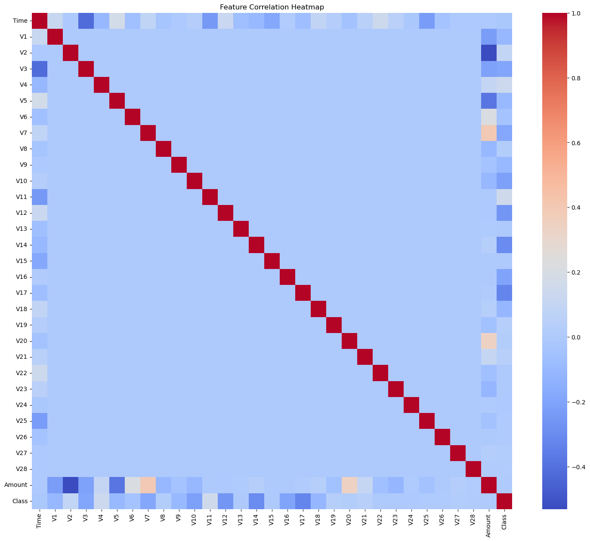
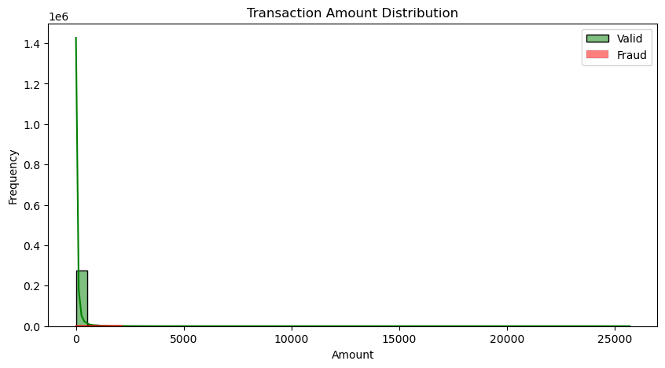
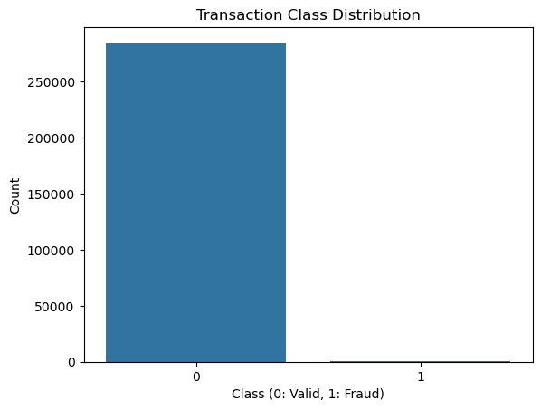
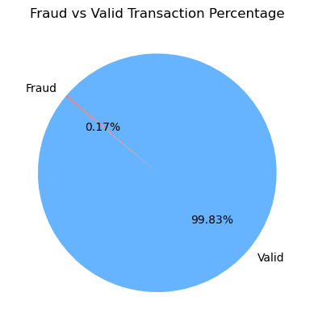
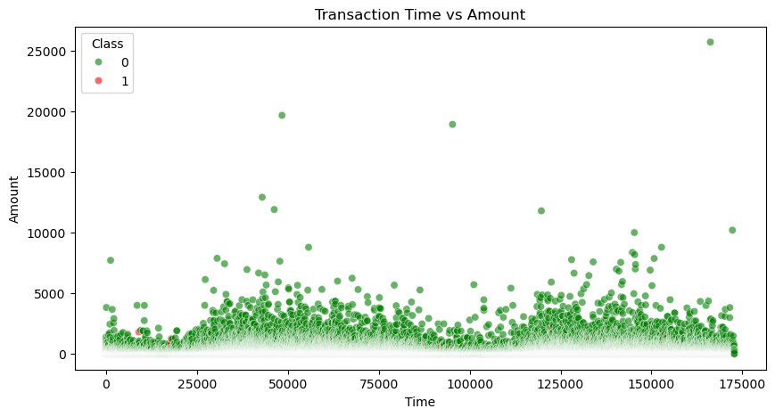
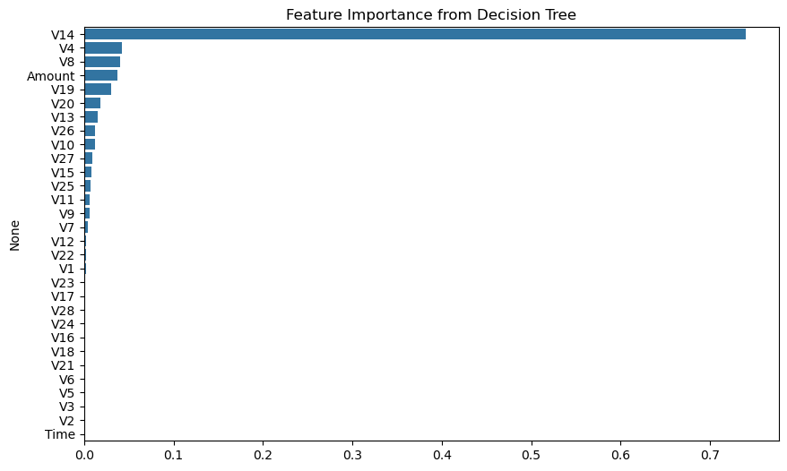

# 💳 Credit Card Fraud Detection 📊

A Machine Learning project to detect fraudulent credit card transactions using classification algorithms like Decision Tree, Random Forest, and K-Nearest Neighbors (KNN).  
This project uses a **balanced dataset via under-sampling** and visualizes data distributions to better understand fraud patterns.

<br>


<br>

---

## 📑 About the Project  

This project demonstrates a **Credit Card Fraud Detection System** using various machine learning models like:

- 🌳 Decision Tree
- 🌲 Random Forest
- 🤝 K-Nearest Neighbors  

It involves data preprocessing, handling class imbalance through undersampling, visualizing key metrics, and evaluating model performance on detecting fraudulent transactions.

<br>

---

## 📂 Project Structure
```bash
📦 CreditCard_Fraud_Detection/
├── 📄 creditcard.csv
├── 📁 Visualising_images/
│ ├── 📊 correlation_heatmap.png
│ ├── 🌳 important_feature_to_DT.png
│ ├── 🕰️ time_vs_amount.png
│ ├── 📉 transaction_amount_distribution.png
│ ├── 📊 transaction_data_dustribution.png
│ └── 📈 transaction_percentage.png
├── 📓 CreditCard_fraud_detection.ipynb
└── 📑 README.md
```

<br>


---

## 📊 Exploratory Data Analysis

### 🔍 Correlation Heatmap  
Shows correlations between features.



---

### 📈 Transaction Amount Distribution  
Amount distribution for valid and fraudulent transactions.



---

### 📊 Transaction Class Distribution  
Visualizing data imbalance before under-sampling.



---

### 📊 Fraud vs Valid Transaction Percentage  
Pie chart showing percentage split.



---

### 🕰️ Transaction Time vs Amount



---

## 🌳 Feature Importance from Decision Tree

Identifying the most influential features in decision-making.



<br>

---

## 📊 Visualizations & Insights

Brief description of the visual insights generated from the dataset and model evaluation:

| 📈 Image | 📝 Description |
|:----------------------------|:----------------------------------------------------------------------------------------------------|
| **`correlation_heatmap.png`** | A heatmap showing the correlation between all numerical features. Helps identify highly related features for better feature selection and model tuning. |
| **`transaction_data_dustribution.png`** | A bar chart representing the original distribution of valid vs. fraud transactions — revealing a severe imbalance, which we handle using undersampling. |
| **`transaction_percentage.png`** | A pie chart visualizing the proportion of fraud and valid transactions. Clearly showcases the minority nature of fraud cases. |
| **`transaction_amount_distribution.png`** | Histograms comparing the transaction amount distribution for valid and fraud transactions, showing how amounts differ across transaction types. |
| **`time_vs_amount.png`** | A scatter plot illustrating transaction amounts over time, differentiated by transaction class — useful for spotting timing patterns or anomalies. |
| **`important_feature_to_DT.png`** | A bar chart displaying the most significant features impacting predictions in the Decision Tree model — offering interpretability into the model’s decision process. |

<br>

---
## 🧠 Models Applied

| Model                  | Accuracy |
|:----------------------|:----------|
| Decision Tree           | 88.83%    |
| Random Forest           | 95.43%    |
| K-Nearest Neighbors (KNN)| 63.96%   |

<br>

---
## 📈 Conclusion

- Random Forest outperformed other models on balanced data.
- Decision Tree provided decent interpretability.
- KNN struggled with this high-dimensional data.
- Data visualization and under-sampling effectively balanced the dataset.

---

## 📑 Requirements

- Python 3.x  
- scikit-learn  
- pandas  
- seaborn  
- matplotlib  
- numpy  

Install them using:
```bash
pip install pandas scikit-learn seaborn matplotlib numpy

```

<br>

---
## 🆘 Help & Support  

Have questions or need assistance? Feel free to connect with me! 🚀  

- 🔗 [](https://www.linkedin.com/in/abhay-kanojia-0461a3341)

Let’s collaborate and build awesome things together! ✨

<br>


